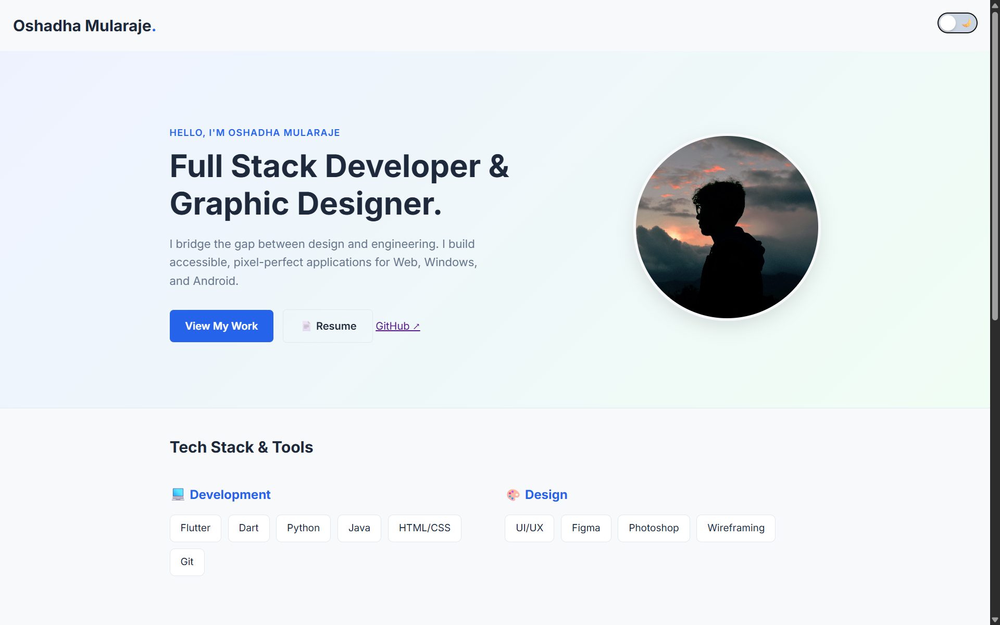
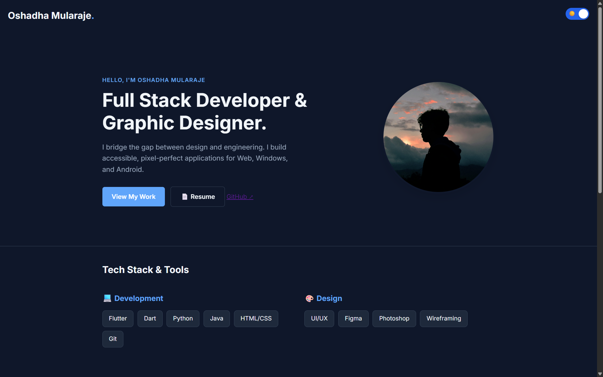

# 👨‍💻 Portfolio Website

  

A professional, responsive portfolio website designed to showcase my Full Stack Development and Design projects.

### 🚀 [View Live Demo](https://[Oshadha369].github.io/portfolio/)

---

## ✨ Features

* **🌓 Dark & Light Mode:** A custom-built theming engine using CSS Variables and LocalStorage to remember user preference.
* **📱 Fully Responsive:** Optimized for Mobile, Tablet, and Desktop using CSS Grid and Flexbox.
* **🎨 Clean UI/UX:** Minimalist design with smooth "Fade In" animations and interactive hover states.
* **⚡ Performance:** Built with pure HTML/CSS/JS (No heavy frameworks) for instant load times.

## 🛠️ Tech Stack

* **Frontend:** HTML5, CSS3 (Custom Properties)
* **Scripting:** Vanilla JavaScript (DOM Manipulation)
* **Fonts:** Inter (Google Fonts)
* **Icons:** CSS-based custom icons

## 📸 Screenshots

| Light Mode ☀️ | Dark Mode 🌙 |
|:---:|:---:|
|  |  |

*(Note: You can take screenshots of your site later and add them to an 'images' folder to make this section appear)*

## 🏃‍♂️ How to Run Locally

1.  **Clone the repository**
    ```bash
    git clone [https://github.com/](https://github.com/)[YOUR_USERNAME]/portfolio.git
    ```
2.  **Navigate to the project directory**
    ```bash
    cd portfolio
    ```
3.  **Open `index.html`** in your browser.

## 📬 Contact

* **Email:** [oshadhamularaja@gmail.com]
* **LinkedIn:** [linkedin.com/in/yourprofile]
* **GitHub:** [github.com/Oshadha369]

---
*© 2025 [Your Name]. Licensed under MIT.*
